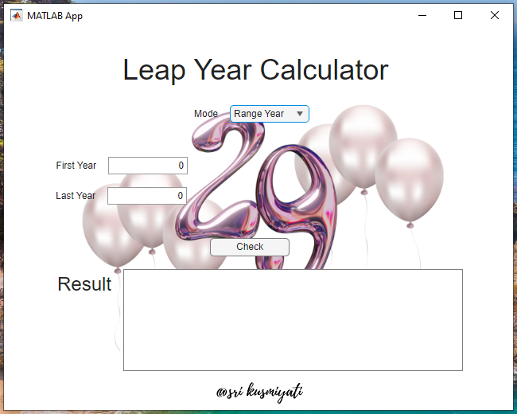
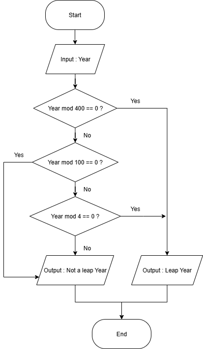
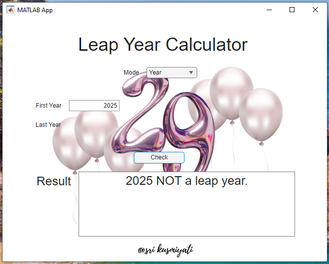
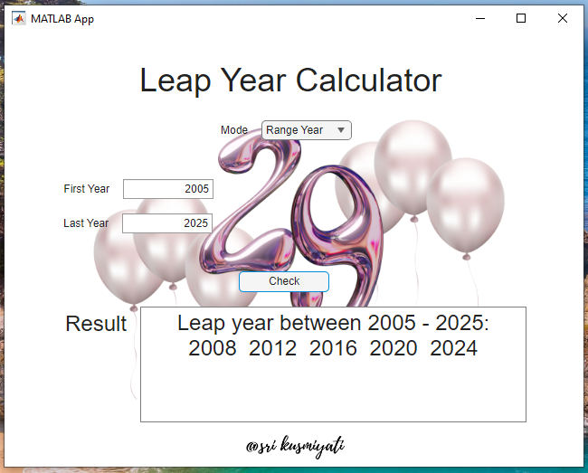
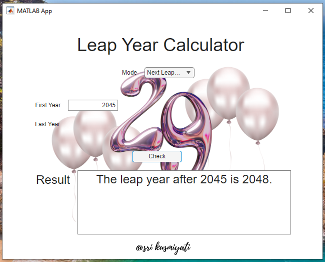

# Leap Year Calculator (MATLAB App Designer)

This repository contains a **Leap Year Calculator** developed using **MATLAB App Designer**.  
The project was created as part of an academic assignment to practice **UI/UX design**, and **logical programming**.

---

## ✨ Features
- **Single Year Check** → Determine whether a given year is a leap year or not.  
- **Year Range Check** → Find all leap years between two user-defined years.  
- **Next Leap Year Prediction** → Given a starting year, the app calculates the next upcoming leap year.  

---

## 📂 Repository Structure

leap-year/
│── src/ # MATLAB source code (.m and .mlapp)
│── preview/ # Flowchart and screenshots of the app
│   ├── uileapyear.png
│   ├── leapyear.png
│   ├── result1.png
│   ├── result2.png
│   ├── result3.png
│── README.md # Project description
|── LICENSE

---

## 🖼️ Preview
Screenshots and flowcharts of the application:

## App UI Example ##
  

## Flowchart 
  

## Sample Results
  
  
  

---

## 🧑‍💻 User Manual

1. **Launching the App**  
   - Open MATLAB.  
   - Navigate to the `src/` folder.  
   - Open `Leap_Year_Calculator.mlapp` in **App Designer**.  
   - Click **Run** to launch the application.  

2. **Choosing Mode**  
   - From the **Mode dropdown**, select one of the available options:  
     - *Year* → For a single year check.  
     - *Range Year* → To check multiple years between a start and end year.  
     - *Next Leap Year* → To calculate the next leap year after the given year.  

3. **Inputting Values**  
   - For *Year* and *Next Leap Year*, enter a year in the **First Year field**.  
   - For *Range Year*, fill in both **First Year** and **Last Year fields**.  

4. **Running Calculation**  
   - Click the **Check** button.  
   - The result will appear in the **Result box** at the bottom of the app.  

5. **Interpreting Results**  
   - The result text will tell you whether the year is a leap year, list leap years in a range, or show the next leap year.  
   - Example outputs:  
     - `2024 is a leap year.`  
     - `Leap years between 2000 - 2010: 2000 2004 2008`  
     - `The leap year after 2021 is 2024.`  

---

## ⚙️ How to Run
1. Clone this repository:
   ```bash
   git clone https://github.com/USERNAME/LeapYearCalculator.git
2. Open src/LeapYearCalculator.mlapp in MATLAB App Designer.
3. Run the app and select one of the three modes.

---

## 📚 References

1. MATLAB R2025a Documentation, MathWorks, 2025. [Online]. Available:
https://www.mathworks.com/help/matlab-appdesigner/
2. L. Doggett, Calendars. University Science Books, 1992.
3. E. M. Reingold and N. Dershowitz, Calendrical Calculations, 4th ed. Cambridge University Press, 2018.
4. G. B. Shelly and H. J. Rosenblatt, Systems Analysis and Design, 9th ed. Cengage Learning, 2011.
